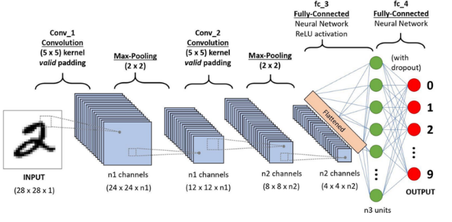
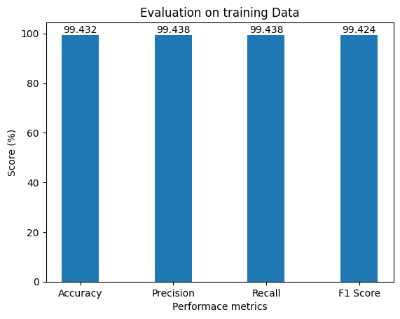
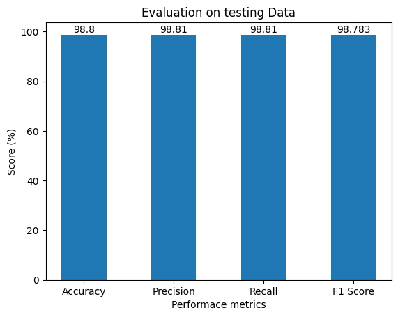
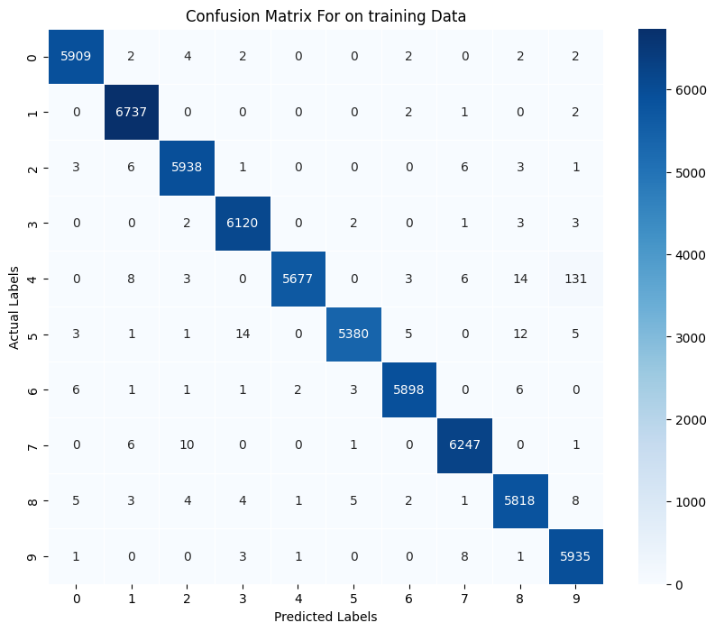

# Handwritten-Digit-Recognition
Handwritten Digit Recognition is the process of digitizing human handwritten digit images. It is a difficult task for the machine because handwritten digits are not perfect and can be made with a variety of flavors. In order to address this issue, we created HDR, which uses the image of a digit to identify the digit that is present in the image. In this project, Convolutional Neural Network (CNN) model is  sed with the Tensorflow framework to Recognition of Handwritten Digit. It used  two pairs of Convolution2D and MaxPooling2D layers. The MaxPooling layer acts as a sort of  ownsampling using max values in a region instead of averaging. After that, we will use Flatten layer to convert multidimensional parameters to vectors. The last layer has a Dense layer with ten Softmax outputs. The result reflects the network guess. The 0th output indicates a likelihood of the input digit being 0, while the 1st output indicates a probability of the input digit being 1, and so on.


## Prerequisite Library

There are some needed Libraries for this project to work. They are 

- numpy
- pandas
- matplotlib
- tensorflow

> **Installation of numpy Library**
```bash
pip install numpy
```
> **Installation of pandas Library**
```bash
pip install pandas

```
> **Installation of scikit learn Library**
```bash
pip install tensorflow
```
> **Installation of matplotlib Library**
```bash
pip install matplotlib
```

> **Installation of matplotlib Library**
```bash
pip install seaborn
```

# Methodology



# Implementation
Following library are used for traing, testing and evaluating the overal projects:

```bash
## For data manupulation

panda
numpy

## For Visualization

matplotlib
seaborn

## For Performance Measures
accuracy_score 
precision_score  
recall_score  
f1_score 
confusion_matrix 

## For Model traning and  Teting
train_test_split 
tf
Sequential
Dense
Dropout
Activation
Flatten
Conv2D
MaxPooling2D


```

# Result and Analysis
Different results are obtained based on the performance metrics (accuracy, precision, recall, and F1 score).  The results of training and testing with **RCNN** machine learning algorithms are displayed in the bar graph below.





There crrosponding confusion metric are:




# Conclusion 
A convolutional neural network (CNN) can reasonably predict handwritten digits.  I successfully constructed handwritten digit recognition using Python, Tensorflow, and Machine Learning frameworks.  Handwritten digits were identified with 99.43% and 98.8% accuracy during training and testing, respectively.

